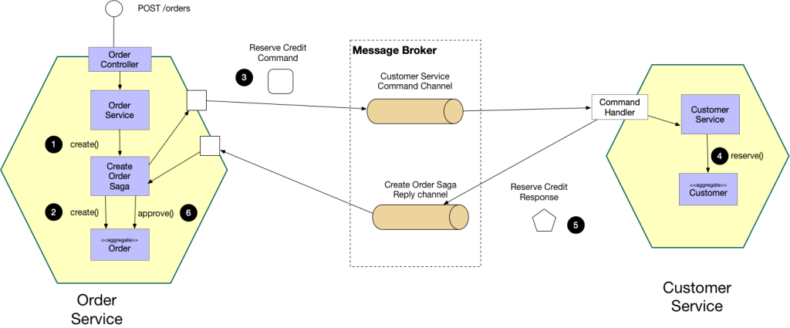

# Saga Pattern Microservices


Simple order flow to demo some concepts: ⚡ = 💗💎❤️

- Microservices using `Spring Boot`, `Spring Cloud`, `Spring Cloud Stream`
- Database per service using `Postgresql`
- Saga Pattern (Saga Orchestration): Distributed transaction span multiple services.
- Outbox Pattern: Avoid dual-writes, no 2PC required using `Kafka`,`Kafka Connect`, `Debezium`
  , `Outbox Event Router`


## Choreography in SAGA Pattern


## Orchestration-based saga



## Prerequisites

- `Java 17`
- `Docker`
- `Docker-run`
- `Docker-compose`

## Structure 'Order-Service' Demo

```text
├── pom.xml
├── src
│   ├── main
│   │   ├── java
│   │   │   └── com
│   │   │       └── hoangtien2k3
│   │   │           └── orderservice
│   │   │               ├── OrderServiceApplication.java
│   │   │               ├── api
│   │   │               │   └── OrderController.java
│   │   │               ├── domain
│   │   │               │   ├── OrderRequest.java
│   │   │               │   ├── OrderUseCase.java
│   │   │               │   ├── PlacedOrderEvent.java
│   │   │               │   ├── entity
│   │   │               │   │   ├── Order.java
│   │   │               │   │   └── OrderStatus.java
│   │   │               │   └── port
│   │   │               │       ├── EventHandlerPort.java
│   │   │               │       ├── OrderRepositoryPort.java
│   │   │               │       └── OrderUseCasePort.java
│   │   │               └── infrastructure
│   │   │                   ├── config
│   │   │                   │   └── JacksonMapperConfig.java
│   │   │                   ├── message
│   │   │                   │   ├── EventHandlerAdapter.java
│   │   │                   │   ├── log
│   │   │                   │   │   ├── MessageLog.java
│   │   │                   │   │   └── MessageLogRepository.java
│   │   │                   │   └── outbox
│   │   │                   │       ├── OutBox.java
│   │   │                   │       └── OutBoxRepository.java
│   │   │                   └── repository
│   │   │                       ├── OrderEntity.java
│   │   │                       ├── OrderJpaRepository.java
│   │   │                       └── OrderRepositoryAdapter.java
│   │   └── resources
│   │       └── application.yml
```

## Get Started

### Setup environment

```shell
## docker run
docker run --name postgres -p 5434:5432 -e POSTGRES_PASSWORD=12042003 -d postgres:16
```

```shell
## docker compose
docker-compose up -d
```

### Build projects

```shell
./mvnw clean package -DskipTests=true
```

### Start Services

Run services `api-gateway`, `order-service`, `customer-service`, `inventory-service`

```shell
./mvnw -f api-gateway/pom.xml spring-boot:run
```

```shell
./mvnw -f order-service/pom.xml spring-boot:run
```

```shell
./mvnw -f customer-service/pom.xml spring-boot:run
```

```shell
./mvnw -f inventory-service/pom.xml spring-boot:run
```

| Service's name    | Endpoint       |
|-------------------|----------------|
| Api Gateway       | localhost:8080 |
| Order service     | localhost:9090 |
| Customer service  | localhost:9091 |
| Inventory service | localhost:9093 |

### Start outbox connectors

Create outbox connectors

```shell
sh register-connectors.sh
```

### Clean Up

Delete all connectors

```shell
sh delete-connectors.sh
```

### Useful commands

Create new customer

```shell
curl --location 'localhost:8080/customer-service/customers' \
--header 'Content-Type: application/json' \
--data '{
    "username": "usertest",
    "fullName": "Test user 1",
    "balance": 100
}'
```

Create new product

```shell
curl --location 'localhost:8080/inventory-service/products' \
--header 'Content-Type: application/json' \
--data '{
    "name": "Test product 1",
    "stocks": 10
}'
```

Create new order

```shell
curl --location 'localhost:8080/order-service/orders' \
--header 'Content-Type: application/json' \
--data '{
    "customerId": "f0a000ad-ea44-4fa1-853b-207f9d9abe2c",
    "productId": "d212c9d6-da3b-4fe2-b016-a852c8a8d32f",
    "quantity": 1,
    "price": 2
}'
```

## Contributing

Pull requests are welcome. For major changes, please open an issue first
to discuss what you would like to change.

Please make sure to update tests as appropriate.

## License

This project is licensed under the [MIT License](./LICENSE)

```text
MIT License
Copyright (c) 2024 Hoàng Anh Tiến
```

## Contributors ✨

<!-- ALL-CONTRIBUTORS-LIST:START - Do not remove or modify this section -->
<!-- prettier-ignore-start -->
<!-- markdownlint-disable -->
<table>
  <tr>
    <td align="center"><a href="https://www.linkedin.com/in/hoangtien2k3/"><br /><sub><b>Hoàng Anh Tiến</b></sub></a><br /><a href="https://github.com/hoangtien2k3/news-app/commits?author=hoangtien2k3" title="Code">💻</a> <a href="#maintenance-hoangtien2k3" title="Maintenance">🚧</a> <a href="#ideas-hoangtien2k3" title="Ideas, Planning, & Feedback">🤔</a> <a href="#design-hoangtien2k3" title="Design">🎨</a> <a href="https://github.com/hoangtien2k3/news-app/issues?q=author%hoangtien2k3" title="Bug reports">🐛</a></td>
  </tr>
</table>

<!-- markdownlint-restore -->
<!-- prettier-ignore-end -->
<!-- ALL-CONTRIBUTORS-LIST:END -->
